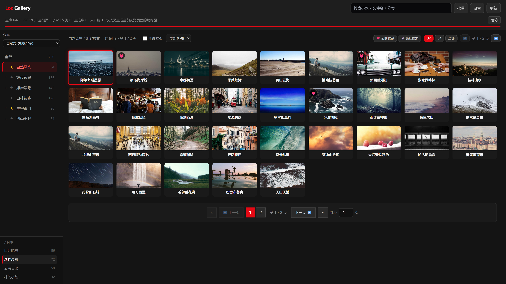
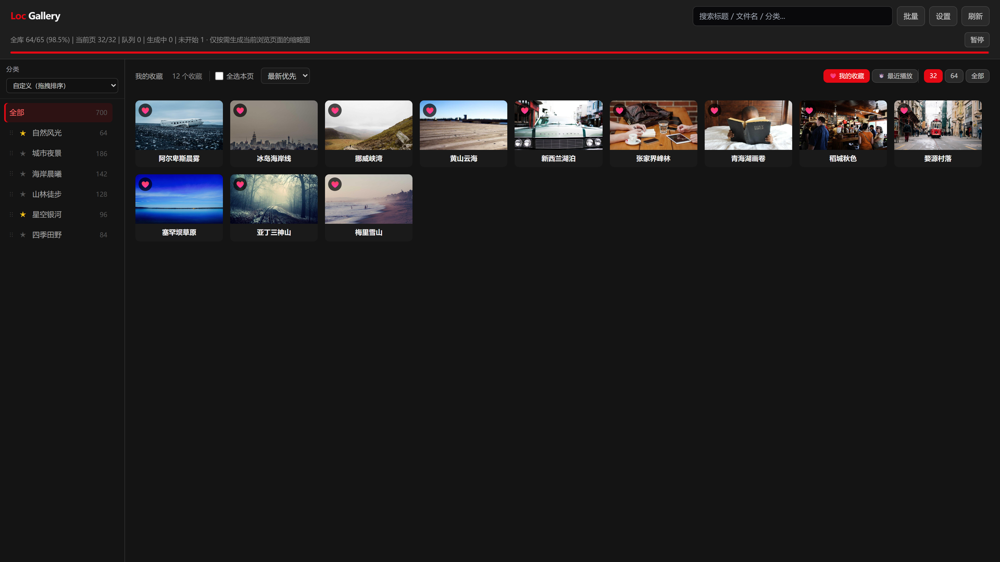
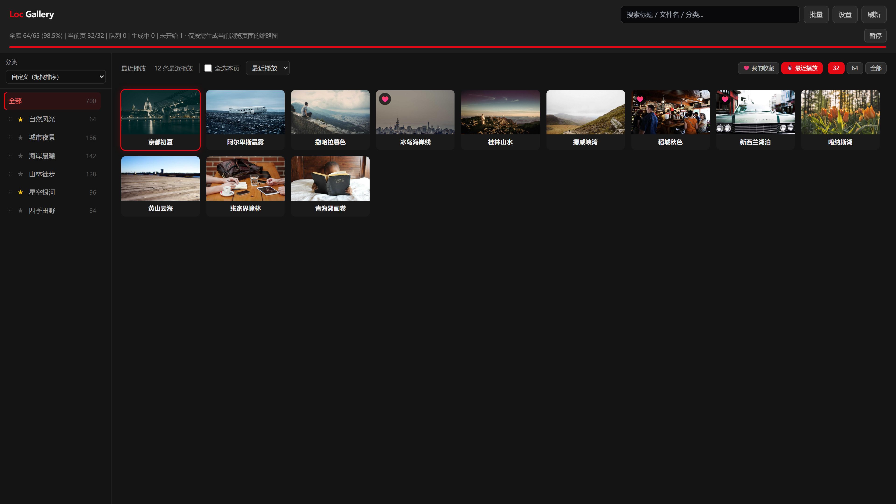
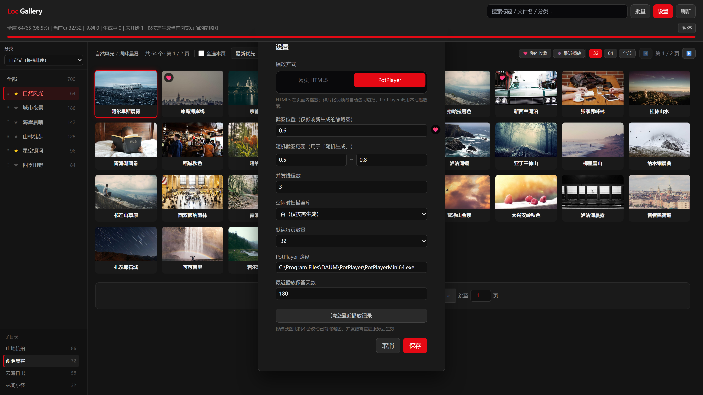
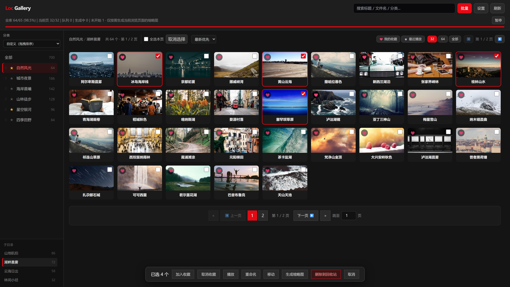

# Loc Gallery

**本地视频画廊 Web 服务 — 双击启动，浏览器里浏览、搜索、播放你的整个视频库**

> **当前版本：3.1.0** · 顶栏导航、YouTube 夜间主题、响应式网格与自适应分页

扫描本机视频目录，自动生成缩略图网格，支持分类筛选、收藏、播放记录、内嵌 HLS 播放与外部播放器。专为 Windows 本地大库设计：新视频拷入即索引，下载中的文件不误报失败，外部删除自动同步收藏与历史。

**默认访问地址：** `http://127.0.0.1:3456`

---

### ✨ 一分钟看懂

<table width="100%">
<tr><td style="white-space: nowrap; width: 1%;"><b>🖱 一键启动</b></td><td>双击 <code>restart.py</code> → 自动停旧进程、起服务、打开浏览器</td></tr>
<tr><td style="white-space: nowrap;"><b>📚 多视频库</b></td><td>顶栏「选择视频库」切换多个本地文件夹；收藏、历史、缩略图、HLS 缓存按库隔离；设置中统一管理</td></tr>
<tr><td style="white-space: nowrap;"><b>📂 本地视频库</b></td><td>递归扫描各库根目录，按一级子目录作为「分类」展示</td></tr>
<tr><td style="white-space: nowrap;"><b>🖼 智能缩略图</b></td><td>按需生成当前页；下载/写入中的文件等待稳定后再处理，不误报失败</td></tr>
<tr><td style="white-space: nowrap;"><b>📺 剧集连播</b></td><td>播放列表支持文件名自然排序；HTML5 模式按列表顺序自动播下一集</td></tr>
<tr><td style="white-space: nowrap;"><b>▶ 可靠播放</b></td><td>HTML5 小块流式直传（省硬盘）；HLS copy / 转码；续播与连播可设置；PotPlayer 自动探测</td></tr>
<tr><td style="white-space: nowrap;"><b>♥ 收藏 & 历史</b></td><td>卡片收藏、最近播放、播放次数与<strong>续播进度</strong>；外部删文件后列表自动清理</td></tr>
<tr><td style="white-space: nowrap;"><b>🔄 实时同步</b></td><td>文件监听 + SSE 推送；新视频自动索引、排队缩略图与播放策略探测</td></tr>
</table>

<table width="100%">
<tr><th>操作</th><th>说明</th></tr>
<tr><td style="white-space: nowrap;">双击 <code>restart.py</code></td><td>启动 / 重启服务</td></tr>
<tr><td>顶栏「♥ 我的收藏」</td><td>只看已收藏视频</td></tr>
<tr><td>顶栏「⏱ 最近播放」</td><td>按播放时间倒序浏览</td></tr>
<tr><td>顶栏「刷新」</td><td>强制重扫视频库</td></tr>
<tr><td>卡片悬停 → ♥</td><td>收藏 / 取消收藏</td></tr>
<tr><td>「批量」模式</td><td>多选删除、移动、批量收藏</td></tr>
</table>

### 界面预览

> 演示数据为风景图占位，非真实视频库内容。

**画廊浏览** — 左侧分类与子目录树，网格分页浏览整个视频库。

<p align="center"></p>

**内嵌播放** — 页面内播放器与右侧播放列表；支持排序、上一个/下一个、HTML5 连播。

<p align="center"></p>

**我的收藏** — 一键筛选已收藏视频，卡片左上角显示红心标记。

<p align="center"></p>

**最近播放** — 按播放时间倒序浏览，快速回到上次看到的内容。

<p align="center"></p>

**设置** — 视频库管理、全局播放与缩略图选项；自动探测 PotPlayer 路径。

<p align="center"></p>

**批量选择** — 多选后批量收藏、移动、删除，底部浮出操作栏。

<p align="center"></p>

---

## 一、为什么你需要这个

管理本地视频库，常见痛点是：

- **文件夹里找** → 没有预览，文件名又长又乱
- **播放器自带库** → 分类弱、缩略图慢、特殊格式搞不定
- **NAS / 媒体服务器** → 配置重、要常驻服务、个人单机用不上
- **下载还没完** → 被索引后缩略图失败，满屏报错

Loc Gallery 的做法是：**只在本机跑一个轻量 Web 服务**，浏览器当界面，ffmpeg 当引擎。文件怎么放磁盘就怎么扫，不搬家、不转码入库；能直传就直传，搞不定的再 HLS。下载中的文件会等稳定后再处理，不会污染失败列表。

## 二、谁适合用

- 在 Windows 上管理**大量本地视频**（多分类目录、多格式混放）
- 希望**浏览器快速浏览缩略图**，偶尔内嵌播放或调 PotPlayer
- 需要**收藏、播放记录、批量整理**，但不需要多用户 / 公网 / 刮削元数据
- 视频库里有**伪装格式**（如 PNG 头 + MPEG-TS）或大体积文件需要 HLS 起播

**不适合：** 多用户远程访问、移动端 App、TMDB 刮削、云端同步。

## 三、核心能力一览

| 模块 | 能力 |
|------|------|
| **多视频库** | 注册多个根目录、顶栏切换、按库隔离数据；`data/libraries.json` + `data/libraries/{id}/` |
| **画廊浏览** | 网格分页、搜索、多种排序、子目录树、面包屑 |
| **分类管理** | 星标置顶、拖拽排序、多种排序模式 |
| **缩略图** | 按需 / 后台补全、队列进度、失败重试、暂停继续 |
| **播放** | HTML5 小块流式直传 / HLS copy / HLS 转 H.264；列表连播与续播可配置 |
| **收藏 & 历史** | 持久化 JSON；外部删文件自动 prune |
| **文件管理** | 删除（回收站）、重命名、移动、打开所在文件夹 |
| **稳定性** | 下载中文件延迟索引；size/mtime 变化时重置缩略图状态 |

> 详细功能规格见 [PRD.md](./PRD.md)。

## 四、工作逻辑

从「视频在磁盘上」到「浏览器里能看能播」，整条链路分 4 个阶段：

```
① 扫描索引 — watchdog 多库监听 + 稳定检测 → scanner 按库缓存 → 内存索引 + 版本号
         ↓
② 缩略图   — 当前页高优先级排队 → ffmpeg 抽帧 → data/libraries/{id}/.thumbs/
         ↓
③ 播放策略 — ffprobe 探测编码/封装 → 写入 playback_plans.json → 选择 direct / HLS
         ↓
④ 前端展示 — SSE 推送进度 → 网格卡片 + 播放器弹层 + 收藏/历史视图
```

**下载中文件的处理：**

```
文件变更事件 → 加入「待稳定」队列 → 等待 size/mtime 不再变化
         ↓
通过稳定性检测 → 纳入索引 → 排队缩略图 & 播放探测
         ↓
若曾被误标失败 → reconcile 重置为「等待」，不计入失败列表
```

## 五、系统架构

```
┌─────────────────────────────────────────────────────────┐
│                    浏览器 (static/)                      │
│  index.html · app.js · style.css · hls.js               │
└────────────────────────┬────────────────────────────────┘
                         │ HTTP / SSE
┌────────────────────────▼────────────────────────────────┐
│              FastAPI (loc_gallery.server)                │
│  REST API · 静态资源 · SSE 事件推送                       │
├──────────┬──────────┬──────────┬──────────┬─────────────┤
│  scanner  │thumb_mgr │hls_mgr   │media_probe│library/    │
│          │          │          │          │favorite/    │
│          │          │          │          │history      │
└────┬─────┴────┬─────┴────┬─────┴────┬─────┴──────┬──────┘
     │          │          │          │            │
     ▼          ▼          ▼          ▼            ▼
  各库视频根   libraries/  cache/hls  playback    favorites.json
  目录        {id}/.thumbs            _plans.json play_history.json
              libraries.json
```

| 层级 | 技术 |
|------|------|
| Web 框架 | FastAPI、uvicorn |
| 文件监听 | watchdog |
| 媒体处理 | ffmpeg、ffprobe |
| 前端 | 原生 ES6+、Tailwind CSS、hls.js |
| 运行时 | Python 3.11+、Windows 10/11 |

## 六、目录结构

```
<项目根目录>/
├── README.md                   # 本文件
├── PRD.md                      # 产品需求文档（功能/API 规格）
├── restart.py                  # 一键重启（先停后起，打开浏览器）
├── pyproject.toml
├── requirements.txt
├── scripts/
│   ├── service.py              # 启停共享逻辑
│   └── build-css.bat           # Tailwind 编译
├── src/loc_gallery/            # Python 后端包
│   ├── config.py               # 端口、常量；VIDEO_ROOT 为默认库种子
│   ├── library_store.py        # 多视频库注册与 CRUD
│   ├── library_context.py      # 请求级当前库上下文
│   ├── server.py               # FastAPI 入口
│   ├── scanner.py              # 视频索引
│   ├── thumb_manager.py        # 缩略图队列
│   ├── media_probe.py          # 播放策略探测
│   ├── hls_manager.py          # HLS 切片缓存
│   ├── favorite_store.py       # 收藏
│   ├── history_store.py        # 播放历史
│   └── file_stability.py       # 下载/写入稳定性检测
├── static/                     # 前端静态资源
├── tests/                      # 集成测试（含 test_multi_library.py）
├── config/
│   └── settings.example.json   # 设置模板
└── data/                       # 运行时数据（gitignored）
    ├── settings.json           # 全局设置
    ├── libraries.json          # 已注册视频库列表
    ├── libraries/
    │   └── {library_id}/       # 每库独立：收藏、历史、缩略图、HLS 缓存等
    └── logs/
```

## 七、环境要求

| 组件 | 要求 |
|------|------|
| 操作系统 | Windows 10/11 |
| Python | 3.11+ |
| ffmpeg / ffprobe | 需在 PATH 中可用（WinGet 安装亦可） |
| Node.js | 仅修改 Tailwind 样式时需要 |

## 八、安装与配置

### 🧠 方式一：AI 傻瓜安装（推荐）

把下面这段提示词复制到 Cursor / OpenCode / Claude Code 等 AI 聊天框发送，AI 会自动完成安装与配置：

```text
请调研 https://github.com/hoolulu/Loc-Gallery 项目，按照 README 依次完成本机安装：

1. 克隆仓库到合适目录（Windows）
2. 确认 Python 3.11+ 可用，执行 pip install -r requirements.txt
3. 确认 ffmpeg 与 ffprobe 在 PATH 中可用（不可用则协助安装，如 WinGet）
4. 询问我的视频库根目录路径，并写入 src/loc_gallery/config.py 的 VIDEO_ROOT
5. 若 data/settings.json 不存在，从 config/settings.example.json 复制并按需配置
6. 运行 python restart.py 启动服务，确认 http://127.0.0.1:3456 可访问
7. 简要说明如何日常使用（重启、设置页、收藏与最近播放）

每完成一步都确认结果，最后总结安装状态与访问地址。不要提交或上传 data/ 目录中的任何文件。
```

AI 会读取项目文档 → 检测本机环境 → 逐项安装配置 → 启动验证。你只需提供**视频库路径**即可。

### 🔧 方式二：手动安装

#### 1. 克隆 / 放置项目

```powershell
git clone https://github.com/hoolulu/Loc-Gallery.git
cd Loc-Gallery
```

或将 Release 解压到任意目录（下文记为 `<项目根目录>`）。

#### 2. 安装 Python 依赖

```powershell
cd <项目根目录>
pip install -r requirements.txt
# 或开发模式：pip install -e .
```

#### 3. 配置视频库路径

编辑 `src/loc_gallery/config.py` 中的 `VIDEO_ROOT` 作为**首个默认库**的种子路径，例如：

```python
VIDEO_ROOT = Path(r"F:\AVV")
```

启动后可在**设置 → 视频库**中添加更多库，或使用顶栏「选择视频库」切换。也可将 `config/settings.example.json` 复制为 `data/settings.json`。

#### 4. 启动服务

```powershell
python restart.py
```

浏览器将自动打开 `http://127.0.0.1:3456`。

#### 5. 编译前端样式（可选）

修改了 `static/tw-input.css` 或 Tailwind 类名后：

```powershell
scripts\build-css.bat
```

### 前置依赖

| 组件 | 必须 | 说明 |
|------|:----:|------|
| **Windows 10/11** | ✅ | 主要开发与运行环境 |
| **Python 3.11+** | ✅ | 运行 FastAPI 后端 |
| **ffmpeg / ffprobe** | ✅ | 缩略图、HLS 切片与播放探测；需在 PATH 中 |
| **Node.js** | ❌ | 仅修改 Tailwind 样式、执行 `build-css.bat` 时需要 |

> **提示：** 服务绑定 `127.0.0.1:3456`，设计为本机使用。PotPlayer 等外部播放器路径请在启动后的**设置页**配置，勿写入公开仓库。

## 九、使用方法

### 多视频库

- 顶栏 **选择视频库** 下拉切换；URL 支持 `?lib=` 参数
- **设置 → 视频库**：管理现有库（别名、路径）、一次性添加新库（别名 + 路径 + 浏览）
- 收藏、历史、缩略图、HLS 缓存、分类元数据按库隔离；播放/缩略图等为**全局设置**

### 播放页与连播

- HTML5 模式下，右侧**播放列表**可按文件名（自然排序）、标题、时间、大小等排序
- 设置中可开关 **播完自动下一集**、**记忆播放位置（续播）**
- **续播**：进度写入 `play_history.json`；再次打开从上次位置继续（≥15 秒且距结尾 ≥45 秒）；直连与 HLS 均支持
- **HTML5 直传读盘**：`/api/stream` 按 256KB 分块推送，播放缓冲接近视频码率，退出后尽快停止读盘（详见 CHANGELOG 3.0.0）
- **HLS 切片**：每段 30 秒；播放器暂停时挂起 ffmpeg，继续播放时恢复
- 追剧建议：筛选到目标文件夹后，每页选「全部」，列表排序选「文件名 A→Z（自然）」

### 日常浏览

1. 启动服务后，左侧选择**分类**，下方可展开**子目录树**
2. 顶栏**搜索框**支持标题、文件名、分类关键词
3. 点击卡片**播放**；悬停左上角 **♥** 收藏
4. **♥ 我的收藏** / **⏱ 最近播放** 切换视图

### 缩略图队列

- 顶栏进度条显示全库 / 当前页 / 队列状态
- 默认**仅按需生成当前浏览页**；可在设置中开启「后台补全全库」
- 可暂停队列、重试失败项、清理孤儿缓存

### 播放模式

在**设置**中选择：

| `player_mode` | 行为 |
|---------------|------|
| `html5` | 页面内播放器 + hls.js |
| `potplayer` | 调用外部 PotPlayer（需配置路径） |

播放策略自动缓存，常见场景：

| 场景 | 策略 |
|------|------|
| 标准 H.264 小 MP4 | 小块流式直传（`/api/stream`） |
| 大文件 / moov 在末尾 | HLS copy |
| AV1 / HEVC / VP9 | HLS 转 H.264 |
| PNG 头 + MPEG-TS 伪装 | HLS copy（`input_format=mpegts`） |

### 文件管理

「批量」模式下可多选，执行删除（回收站）、移动、批量收藏。

## 十、设置项（全局）

在设置面板中统一保存至 `data/settings.json`：

| 键 | 默认值 | 说明 |
|----|--------|------|
| `thumb_position` | 0.6 | 截图时间点（时长比例） |
| `thumb_random_min` / `max` | 0.5 / 0.8 | 随机截图范围 |
| `thumb_workers` | 3 | 缩略图并发数（修改后需重启服务） |
| `thumb_idle_scan` | false | 后台补全全库缩略图 |
| `default_page_size` | 32 | 每页条数 |
| `player_mode` | html5 | html5 / potplayer |
| `html5_playlist_autoplay` | true | 播完是否按列表连播下一集 |
| `html5_resume_playback` | true | 是否记忆播放位置并续播 |
| `html5_fragmented_mp4` | external | 碎片化 MP4：PotPlayer 弹窗 / 边切边播 |
| `hls_large_h264` / `hls_moov_end_h264` | false | 大文件 / moov 在末尾是否强制 HLS |
| `potplayer_path` | （自动探测） | 外部播放器路径 |
| `history_retention_days` | 180 | 播放历史保留天数 |

## 十一、开发

```powershell
cd <项目根目录>
$env:PYTHONPATH = "<项目根目录>\src"
python -m uvicorn loc_gallery.server:app --host 127.0.0.1 --port 3456 --reload
```

### 测试

```powershell
# 部分测试需先启动服务
python tests\test_auto_new_video.py
# 伪装格式测试需本机样本，不内置路径：
# $env:LOC_GALLERY_DISGUISED_SAMPLE = "D:\path\to\sample.mp4"
python tests\test_disguised_pipe.py
python -m pytest tests\test_file_stability.py
python -m pytest tests\test_multi_library.py
```

## 十二、隐私与分享

本项目设计为**纯本地、单用户**使用。分享代码或打包给他人时，请注意：

| 可分享 | 勿分享（含个人隐私） |
|--------|----------------------|
| `src/`、`static/`、`scripts/`、`tests/` | 整个 `data/` 目录 |
| `config/settings.example.json` | 整个 `data/` 目录（含路径与索引） |
| `README.md`、`PRD.md`、`CHANGELOG.md` | `data/settings.json` |
| | `data/libraries.json`、`data/libraries/` |
| | `data/logs/server.log`、根目录 `server.log` |

**源码中不应出现：**

- Windows 用户名（如 `C:\Users\...`）
- 本机软件安装路径（PotPlayer 等请在设置里配置，不要写进 `config.py`）
- 真实视频文件名（测试脚本通过环境变量传入样本）

**视频库路径 `VIDEO_ROOT`（如 `F:\AVV`）** 仅保留在你本机的 `config.py` 中即可，无需为了分享而修改——对方克隆后会改成自己的路径。

`.gitignore` 已默认忽略 `data/` 与 `server.log`。若初始化 Git 仓库，请勿将上述运行时文件加入版本库。

## 十三、FAQ

**1. 视频库放哪？项目放哪？**

- **视频库**：在设置 → 视频库管理中配置（支持 Windows 文件夹选择器）；`config.py` 的 `VIDEO_ROOT` 仅作首次迁移默认种子
- **项目**：任意目录均可；扫描时会自动忽略 `Loc-Gallery` / `loc-gallery` 等项目自身目录名

**2. 下载中的视频为什么之前会显示缩略图失败？**

文件仍在写入时 size/mtime 持续变化，ffmpeg 抽帧会失败。现在会等文件稳定后再索引和生成缩略图；已误标的失败状态会自动重置。

**3. 外部删除了视频，收藏和历史还在吗？**

不会。文件删除触发库刷新后，会自动从当前库的 `favorites.json` 与 `play_history.json` 中移除对应条目。

**4. 多个视频库的数据存在哪？**

`data/libraries.json` 登记库列表；每库数据在 `data/libraries/{library_id}/`（收藏、历史、缩略图、HLS 缓存等）。全局设置在 `data/settings.json`。

**5. 能暴露到局域网或公网吗？**

不建议。服务无认证，设计为 `127.0.0.1` 本机使用。若改 `HOST` 请自行评估风险。

**6. 伪装 MPEG-TS 是什么？**

部分文件扩展名为 `.mp4`，文件头却是 PNG 魔数，偏移后为 MPEG-TS 流。探测后使用 `-f mpegts` 切片，详见 PRD 附录。

**7. HLS 缓存占多少磁盘？**

默认上限 5GB（LRU 淘汰）。2.1.0 起每段 **30 秒**（旧版 6 秒），同样时长影片产生的 `.ts` 文件更少。已有 6 秒缓存会在升级后自动作废并重新切片。

**8. 续播进度存在哪？**

`data/libraries/{library_id}/play_history.json` 的 `position_sec` 字段；HTML5 直连与 HLS 均支持。HLS 边切边播时，若目标位置尚未切片完成，可能需要等待缓冲。

## 十四、日志与排错

| 路径 | 内容 |
|------|------|
| `data/logs/server.log` | 服务运行日志 |
| `data/.server.pid` | 当前进程 PID |

常见问题：

- **端口 3456 被占用** → 再运行一次 `restart.py`（会先停旧进程）
- **缩略图全失败** → 检查 `ffmpeg -version` 是否在 PATH 中
- **播放黑屏** → 查看播放策略是否为 `unsupported`，或等待 HLS 切片完成

## 十五、已知限制

1. 主要为 Windows 环境优化
2. 单用户本地，无认证
3. 大库首次打开当前页时，缩略图按需生成，可能有短暂等待
4. H.264 转码播放 CPU 占用较高

## 许可证

私有项目，仅供个人使用。

---

**Loc Gallery** — 本地视频，浏览器里看。

讨论与交流 → [LINUX.DO 社区](https://linux.do)
